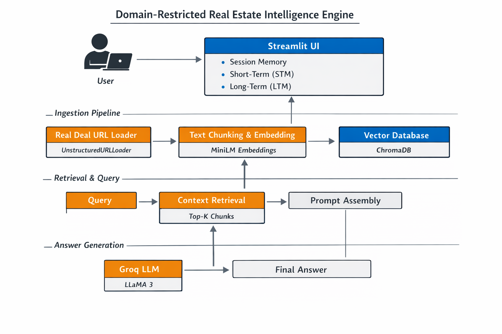

# 🏙️ Real Estate Intelligence Engine  
### Domain-Restricted Retrieval-Augmented Generation (RAG) System

---

## 📌 Overview

The **Real Estate Intelligence Engine** is a **domain-restricted AI application** built using **Retrieval-Augmented Generation (RAG)** to answer questions strictly from **verified real estate journalism**.

Unlike traditional chatbots that rely on a language model’s internal knowledge, this system **retrieves factual context from articles first** and then generates answers **only from that retrieved information**.  
If the answer is not present in the source content, the system explicitly responds that it does not know.

🔒 **Supported Source (Intentional Constraint):**  
**The Real Deal** — a leading real estate news platform.

---
## 🏗️ System Architecture

  

  <i>High-level architecture of the Domain-Restricted RAG System</i>

## ❓ Why This Project Exists

Most GenAI demos fail in real-world settings due to:
- Hallucinated facts
- Unverifiable answers
- Poor memory handling
- Tightly coupled UI and backend
- Unsafe multi-user behavior

This project is designed to address those problems by focusing on:
- **Strict data grounding**
- **Explicit retrieval pipelines**
- **Stateless backend design**
- **Session-safe memory**
- **Production-style architecture**

---

## 🧠 What is Retrieval-Augmented Generation (RAG)?

**Retrieval-Augmented Generation (RAG)** is the core principle of this system.

Instead of generating answers directly from the LLM’s internal knowledge:
1. Relevant article chunks are retrieved from a **vector database**
2. These chunks are injected into the prompt as **context**
3. The LLM is constrained to answer **only from the provided context**

If relevant context is not found, the system responds:
> **“I don’t know based on the provided article.”**

This ensures:
- Reduced hallucinations
- Higher factual accuracy
- Traceable answers
- Enterprise-ready reliability

---

## 🔄 End-to-End RAG Workflow

### 1️⃣ Document Ingestion
- Verified articles are loaded from URLs
- Raw HTML is cleaned and parsed
- Text is split using **recursive character-based chunking**
- Each chunk is converted into dense embeddings
- Embeddings are stored in a vector database

### 2️⃣ Retrieval
- User question is embedded
- Similarity search retrieves the **Top-K most relevant chunks**
- Only these chunks are passed to the LLM

### 3️⃣ Generation
- Prompt is assembled using:
  - Retrieved context (primary source of truth)
  - Conversation summary
  - Recent conversation turns
- The LLM generates an answer strictly from context

---

## 🧠 Memory Architecture

This system uses a **dual-memory strategy** for conversational continuity and scalability.

### 🔹 Short-Term Memory (STM)
- Stores recent user–assistant exchanges
- Maintains conversational flow
- Limited window to avoid token overflow

### 🔹 Long-Term Memory (LTM)
- Older conversations are summarized automatically
- Only important facts and user intent are retained
- Prevents prompt bloat while preserving context

### 🔹 Memory Placement
- Memory is managed at the **session level**
- Backend remains **stateless**
- Enables safe multi-user deployment

---

## ⚙️ Technology Stack

| Layer | Technology |
|-----|-----------|
| Frontend | Streamlit |
| RAG Framework | LangChain |
| Vector Database | ChromaDB |
| Embedding Model | all-MiniLM-L6-v2 |
| LLM Inference | Groq (LLaMA-3.x) |
| Memory Strategy | Session-based STM + summarized LTM |
| Deployment | Streamlit Cloud |

---

## 🔒 Trust, Safety & Hallucination Control

This system prevents hallucinations **by architecture**, not by prompt tricks:

- ❌ No open-web search
- ❌ No fallback generation
- ❌ No external knowledge injection
- ✅ Retrieval-only answering
- ✅ Domain-restricted ingestion

The LLM is **never allowed to answer without retrieved evidence**.

---

## 🚀 Deployment

The application is deployed using **Streamlit Cloud**, making it:
- Publicly accessible
- Easy to demo for recruiters
- Suitable for rapid iteration

🔗 **Live App:** *(https://genairesearchtool-9ychimscjq2dzqryq2548p.streamlit.app/)*

---

## 🎯 Key Engineering Takeaways

- RAG systems are about **retrieval discipline**, not just embeddings
- Memory must be **designed**, not appended blindly
- Stateless backends scale better and avoid data leakage
- Constraining data sources improves trust and correctness
- UI-managed memory is safer for multi-user GenAI apps

---

## 🔮 Future Enhancements

- Persistent vector storage
- Source citation highlighting
- Confidence scoring for answers
- Multi-domain indexing
- RAG evaluation metrics (faithfulness, recall)

---

## 🤝 Connect

If you are interested in:
- GenAI engineering
- RAG system design
- LLM-powered applications
- Trustworthy AI systems

Feel free to connect and discuss ideas.

---

⭐ If you find this project useful, consider starring the repository.
